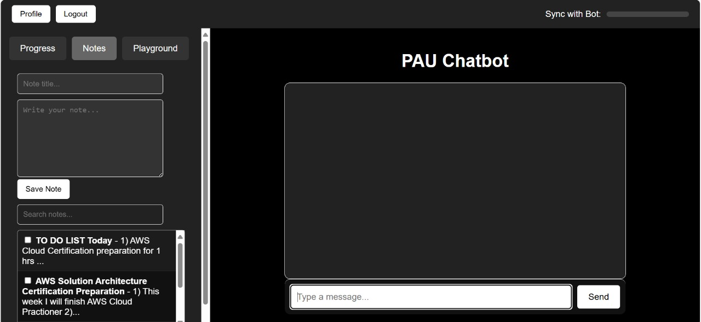
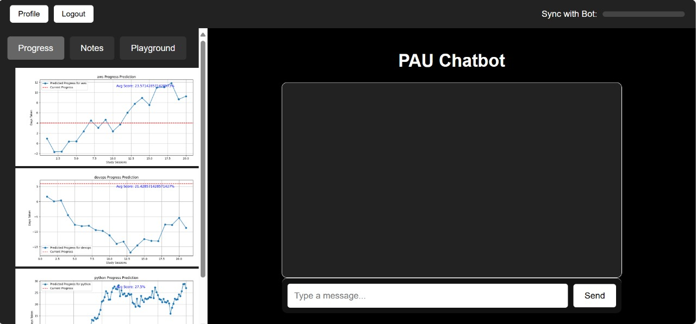
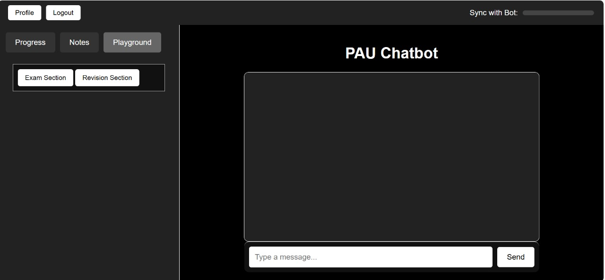
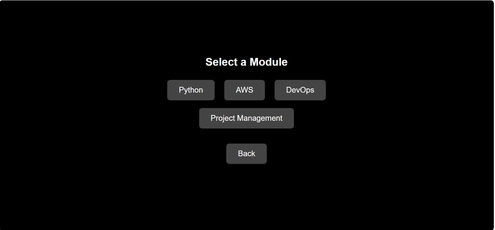
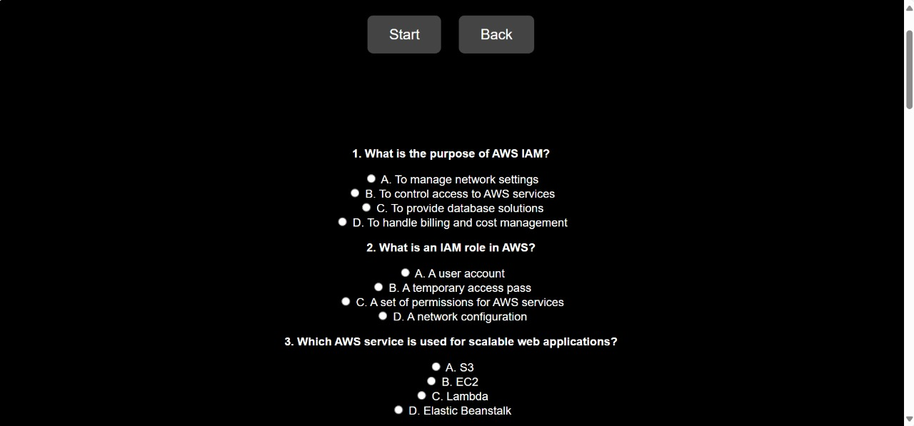

PAU - Personal Assistant for Upskilling

Overview

PAU (Personal Assistant for Upskilling) is a web application designed to help users enhance their skills through interactive quizzes, note management, chat assistance, and progress tracking. This project integrates multiple functionalities, including AI-powered responses, personalized learning, and progress visualization.

Features

1. Quiz System

Module-Based Quizzes: Users can select different learning modules (e.g., Python, AWS, DevOps, Networking) and attempt quizzes.

Randomized Questions: Questions are served randomly from a JSON dataset.

Scoring Mechanism: Scores are calculated based on correct and incorrect answers, with timestamps recorded for tracking progress.

Progress Graphs: Generates and updates progress graphs based on quiz results.

2. Chat Assistance

AI-Powered Responses: The chatbot provides contextual responses by retrieving relevant notes and past chat history.

Note Integration: Fetches stored notes to enhance personalized recommendations.

Conversation Logging: Stores chat history for future reference and better AI interaction.

3. Notes Management

Create, Save, and Retrieve Notes: Users can store learning notes and retrieve them when needed.

Topic-Based Organization: Helps in structuring notes for easy reference.

Deletion and Update Functionality: Enables users to manage notes effectively.

4. Progress Tracking

Visualization of Quiz Performance: Generates progress graphs using Matplotlib.

Stores Quiz Results: Tracks scores over time for each module.

5. Daily Learning Tasks

Extracts Topics from Chat History & Notes: Uses AI to generate quizzes based on the user’s recent learning topics.

Automated Quiz Generation: AI generates MCQs from the user’s recent activities.

App Interface

Here is a preview of the PAU application:

Notes Section:

Progress Section:

Playground Section:

   - If you click on Exam Section:

      

   -If you click on Revision Section:

      

Installation

Prerequisites

Python 3.8+

Flask

OpenAI API Key (for AI-related functionalities)

dotenv (for managing environment variables)

Setup

Clone the repository:

git clone https://github.com/your-repo/PAU.git
cd PAU

Create and activate a virtual environment:

python -m venv venv
source venv/bin/activate  # On Windows: venv\Scripts\activate

Install dependencies:

pip install -r requirements.txt

Create a .env file and add your OpenAI API Key:

echo "OPENAI_API_KEY=your_api_key_here" > .env

Run the application:

flask run

Project Structure

PAU/
│── app/
│   │── routes/
│   │   │── quiz_routes.py        # Handles quiz logic
│   │   │── chat_routes.py        # Manages chatbot and history
│   │   │── note_routes.py        # Handles notes creation and retrieval
│   │   │── progress_routes.py    # Generates progress graphs
│   │   │── doittoday_routes.py   # Generates daily learning quizzes
│   │── config.py                  # Application configurations
│   │── __init__.py                 # Flask app initialization
│── data/
|   │── notes/                    # To store the notes in the folder
|   |  │── notes.json
│   │── question_quiz.json        # Quiz questions database
│   │── scores.json               # Stores quiz scores
|   │── doittoday_scores.json     # Stores scores on the topics studied today
│── docker/                       #Store the docker files
|   │── DockerFile
|   │── docker-compose.yml
|   │── .dockerignore  
│── generated_graphs\             #Updated graph of progress is stored here
|   │──progress_graphs\          
│── public/
│   │── templates/                # HTML templates
│   │── static/                   # CSS, JS, images
│── log/                          # Stores chat history logs
│── env                          # Environment variables
│── app.py                       # Main file to run the application
│── requirements.txt              # Required dependencies
│── README.md                     # Project documentation

API Endpoints

Quiz Routes

GET /quiz/<module_name> - Renders the quiz page.

GET /api/quiz/<module_name> - Fetches quiz questions.

POST /api/submit_quiz - Submits quiz answers and calculates scores.

Chat Routes

POST /chat - Processes user messages and returns AI-generated responses.

Notes Routes

POST /notes/save - Saves a new note.

GET /notes/get - Retrieves all saved notes.

POST /notes/delete - Deletes selected notes.

POST /notes/open - Opens selected notes.

Progress Routes

GET /progress/graph - Serves the progress graph.

GET /progress/update - Updates and returns progress graph data.

Do It Today (Daily Learning)

GET /generate_quiz - Generates AI-powered quizzes based on recent learning topics.

POST /submit_quiz - Submits quiz answers and returns scores.

Future Enhancements

User Authentication: Implement user logins for personalized tracking.

Leaderboard System: Compare scores with other users.

AI-based Personalized Learning Path: Dynamically suggest learning modules.

Integration with Cloud Storage: Sync progress and notes across devices.

Contributing

Contributions are welcome! Feel free to open issues or submit pull requests.

License

This project is licensed under the MIT License.